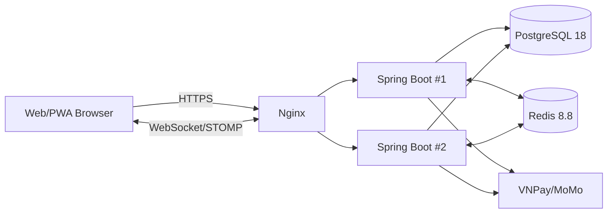
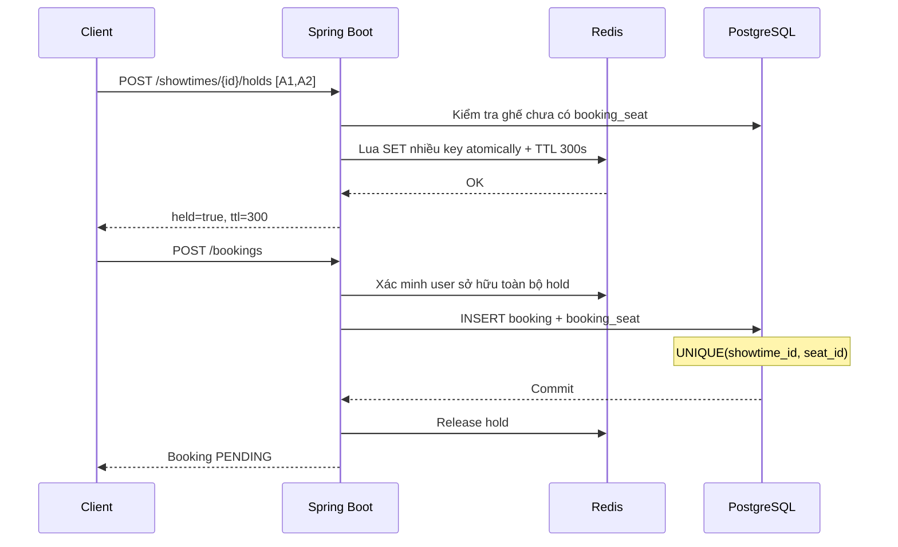

# Kiến trúc CineBooking Pro

## 1. Mục tiêu

- Web/PWA đa nền tảng cho khách hàng.
- Backend có thể chạy nhiều instance sau Nginx.
- Redis dùng cho giữ ghế tạm thời và chống tranh chấp ở lớp tốc độ cao.
- PostgreSQL là nguồn dữ liệu cuối cùng; ràng buộc `UNIQUE(showtime_id, seat_id)` là lớp bảo vệ cuối chống bán trùng.
- WebSocket/STOMP phát sự kiện thay đổi trạng thái ghế. Redis Pub/Sub fan-out sự kiện giữa nhiều backend instance để mọi WebSocket client đều nhận được cập nhật.
- Hỗ trợ Mock payment để demo không cần merchant, và adapter VNPay/MoMo sandbox khi có credentials.

## 2. Sơ đồ thành phần

## 3. Luồng giữ và đặt ghế

## 4. Vì sao có cả Redis và UNIQUE constraint?

Redis giúp phản hồi nhanh và hạn chế contention trước khi chạm DB. Tuy nhiên lock/cache không nên là nguồn chân lý duy nhất. Ràng buộc duy nhất trong PostgreSQL đảm bảo kể cả khi TTL hết hạn, network partition hoặc hai request lọt qua cùng lúc thì chỉ một booking có thể sở hữu cặp `(showtime_id, seat_id)`.

## 5. Trạng thái

Booking: `PENDING -> CONFIRMED`, hoặc `PENDING -> CANCELLED/EXPIRED`.

Payment: `PENDING -> SUCCESS/FAILED`.

Khi booking hết hạn, job chạy mỗi 30 giây xóa `booking_seat` và chuyển booking sang `EXPIRED`, nhờ đó ghế được mở lại.
