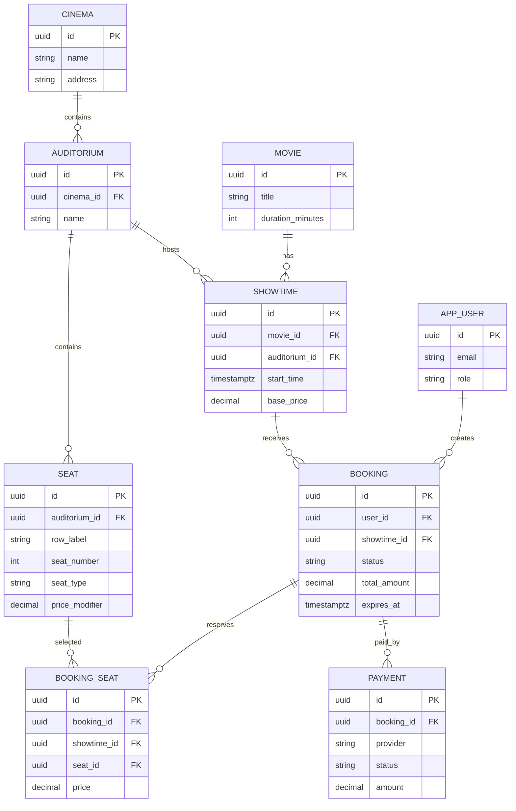

# ERD

```mermaid
erDiagram
  APP_USER ||--o{ BOOKING : creates
  MOVIE ||--o{ SHOWTIME : has
  CINEMA ||--o{ AUDITORIUM : contains
  AUDITORIUM ||--o{ SEAT : contains
  AUDITORIUM ||--o{ SHOWTIME : hosts
  SHOWTIME ||--o{ BOOKING : receives
  BOOKING ||--o{ BOOKING_SEAT : reserves
  SEAT ||--o{ BOOKING_SEAT : selected
  BOOKING ||--o{ PAYMENT : paid_by

  APP_USER { uuid id PK string email string role }
  MOVIE { uuid id PK string title int duration_minutes }
  CINEMA { uuid id PK string name string address }
  AUDITORIUM { uuid id PK uuid cinema_id FK string name }
  SEAT { uuid id PK uuid auditorium_id FK string row_label int seat_number string seat_type decimal price_modifier }
  SHOWTIME { uuid id PK uuid movie_id FK uuid auditorium_id FK timestamptz start_time decimal base_price }
  BOOKING { uuid id PK uuid user_id FK uuid showtime_id FK string status decimal total_amount timestamptz expires_at }
  BOOKING_SEAT { uuid id PK uuid booking_id FK uuid showtime_id FK uuid seat_id FK decimal price }
  PAYMENT { uuid id PK uuid booking_id FK string provider string status decimal amount }
```
